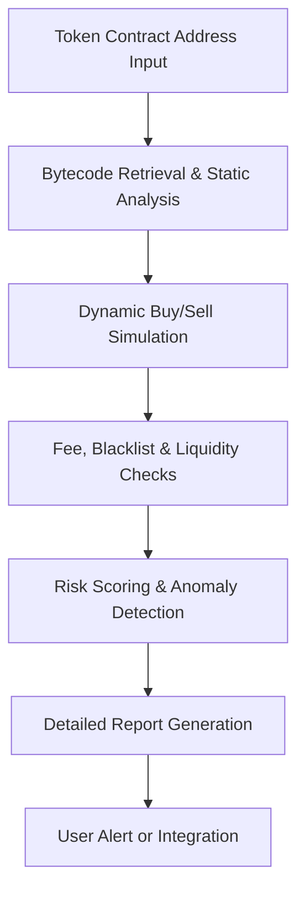

# Honeypot Checker Crypto

Deploy Honeypot Checker Crypto as an on-chain contract analysis execution layer for detecting sell restrictions, blacklists, malicious fees, and rug risks in new tokens with simulation-based verification and detailed reports across major chains.

### Introduction to Honeypot Detection Tools

Honeypot tokens trick users into buying while preventing sells. A **Honeypot Checker Crypto** functions as a specialized **contract simulation and risk analysis engine** that evaluates tokens for common scam patterns before users interact with them.

Traders and DeFi users rely on these tools to avoid financial losses from fraudulent tokens and make more informed investment decisions.

### Inside the System: Core Mechanism

The checker operates as a **hybrid static and dynamic analysis layer**. It performs:

- Static bytecode analysis for hidden functions and ownership privileges
- Dynamic simulation of buy and sell transactions in a forked environment
- Liquidity and holder distribution checks
- Tax and fee mechanism verification
- Risk scoring based on detected patterns

Results are delivered with clear explanations and risk levels for quick decision-making.

### Target Audience and Practical Use Cases

This execution layer targets:
- Memecoin and new token traders
- DeFi users evaluating liquidity pools
- Developers auditing contracts
- Security-conscious investors

Common applications include:
- **Pre-purchase token verification** on DEX launches
- **Liquidity pool health checks**
- **Batch scanning** of trending tokens
- **Automated trading bot safety filters**

### Technical Architecture and Operational Logic

A robust Honeypot Checker Crypto includes:

- **Contract Ingestion Layer**: Address and chain input with bytecode retrieval
- **Static Analysis Module**: Pattern matching for known malicious code
- **Dynamic Simulation Engine**: Forked buy/sell transaction testing
- **Risk Scoring System**: Weighted heuristics and detailed explanations
- **Reporting Dashboard**: Clear flags and remediation suggestions

**Operational Logic Flowchart**

### Key Features and Technical Advantages

- **Simulation-Based Detection**: Most accurate for runtime honeypot behavior
- **Multi-Chain Support**: Ethereum, Solana, Base, BSC, and more
- **Comprehensive Checks**: Taxes, sell restrictions, ownership, and more
- **Fast Scanning**: Results in seconds for real-time decision-making
- **Integration Ready**: API support for trading bots and dashboards

The system provides higher accuracy than manual review by combining static patterns with live simulation.

### Where It Fits in the Market: Comparison Table

| Aspect                | Honeypot Checker Crypto | Basic Token Sniffer   | DexScreener Security | Manual Contract Review |
|-----------------------|-------------------------|-----------------------|----------------------|------------------------|
| Detection Method     | Static + Simulation    | Pattern matching      | Basic flags          | Human expertise        |
| Accuracy             | High                   | Moderate              | Surface-level        | Variable               |
| Speed                | Seconds                | Fast                  | Instant              | Slow                   |
| Multi-Chain          | Broad                  | Good                  | Platform-specific    | Limited                |
| Best Use Case        | Pre-trade verification | Quick scans           | Market overview      | Thorough audits        |
| Automation           | Full API integration   | Moderate              | Limited              | None                   |

### Risk Surface and Limitations

Honeypot detection tools have important limitations:
- **Dynamic Scams**: Contracts can change behavior after scanning
- **False Negatives**: Sophisticated obfuscation may evade detection
- **False Positives**: Legitimate complex contracts can trigger warnings
- **Chain-Specific Gaps**: New or obscure chains may have incomplete coverage
- **Evolving Threats**: Scammers continuously develop new techniques

**Optimization Note**: Use multiple independent checkers, perform manual verification of critical contracts, check recent transactions on explorers, and never rely solely on automated tools for significant investments.

### Deployment Profile and Getting Started

1. **Tool Selection**: Choose web-based, API, or self-hosted solutions based on volume.
2. **Basic Usage**: Enter contract address and chain for instant analysis.
3. **Integration**: Connect APIs to trading bots or custom dashboards.
4. **Workflow**: Combine with liquidity and team checks for complete due diligence.
5. **Advanced Use**: Run batch scans or set up continuous monitoring for watchlists.

Open-source and commercial options provide various levels of customization.

### Conclusion

The Honeypot Checker Crypto serves as an essential risk analysis execution layer for navigating the high-risk environment of new tokens. Its combination of static analysis, dynamic simulation, and clear reporting helps users avoid common scams. For traders and developers who use it as part of a broader due diligence process, it significantly reduces exposure to malicious contracts.

### FAQ

**How accurate are Honeypot Checkers?**  
They are highly effective at detecting common patterns and runtime issues but are not foolproof. Always combine with manual verification and multiple tools.

**Does it work on Solana tokens?**  
Yes. Specialized checkers analyze token authorities, metadata, and swap simulations for Solana programs.

**Can a token pass a check and still be malicious?**  
Yes. Dynamic or time-based malicious logic can activate after scanning. Treat all new tokens as high-risk.

**Are these tools free to use?**  
Many public web checkers are free for basic scans. Advanced API access or self-hosted versions may involve costs.

**How does a Honeypot Checker compare to full audits?**  
Bots provide fast, automated surface-level detection. Professional audits offer deep manual review of logic, economics, and long-term security for critical projects. Use both when appropriate.
